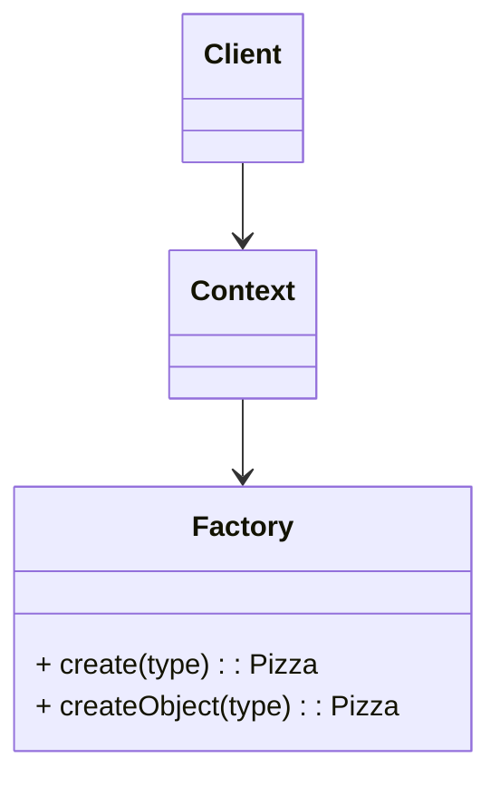
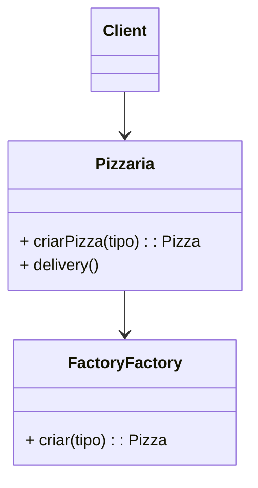

# Desafio DevPizza

> Neste desafio iremos exercitar nossa capacidade de abtração para com o uso da Orientação a Objetos.

Criar uma coleção de classes necessárias para representar a abstração de Pizzas de uma Pizzaria.
Inicialmente serão utilizadas as Pizzas do tipo:
* Calabresa;
* Portuguesa;
* Quatro queijos;
* Cangaceira;

Esta coleção de facilitar a criação das Pizzas.
Cada Pizza terá um método de descrição onde haverá o nome, o valor e os ingredientes da Pizza.

# Resolução do DevPizza

Para resolução deste desafio iremo utilizar o Pattern Factory.

> O Factory encapsula a criação da criação de um objeto em uma classe criadora com as resgras de criação encapsuladas em um método criador.

## O Simple Factory

## O Factory DevPizza

Esta é a modelagem do Simple Factory adaptado ao nosso desafio.

